XILINX ISE INSTALLATION FOR WINDOWS 10/11 ![ref1]

1. Go to the website : h  ps://www.xilinx.com/downloadNav/vivado-design-tools/archive- ise.html 

   Download the 14.7  

   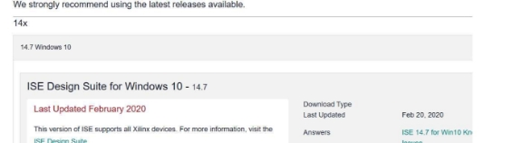

   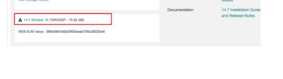

2. Sign in to your account. If you have not done before, then register and then download 

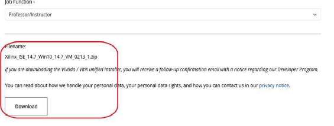

3. Download begins.  Meanwhile we will install Virtualbox. Navigate to the website: h  ps://www.virtualbox.org/wiki/Downloads 

   Select Windows Host 

   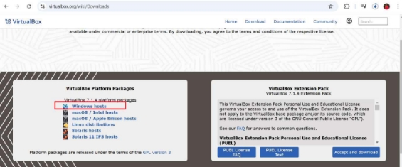

   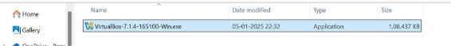

   Double click and Install  ( Proceed , accept all terms, keep doing Yes and install it !) You will get the below.  ![ref2]

   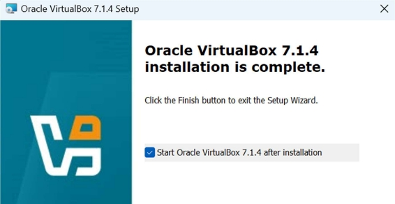

   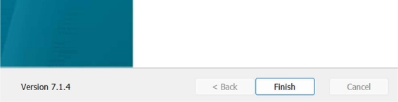

   Click FINISH. You will be able to see the below window. KEEP THIS WINDOW OPEN AND JUST MINIMIZE IT 

   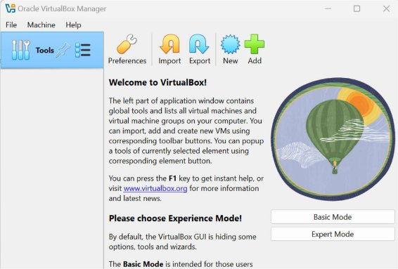

   KEEP THIS WINDOW OPEN AND JUST MINIMIZE IT ![ref2]

4. Once Xilinx download is finished, Unzip and double click --run the xsetup.exe file 

   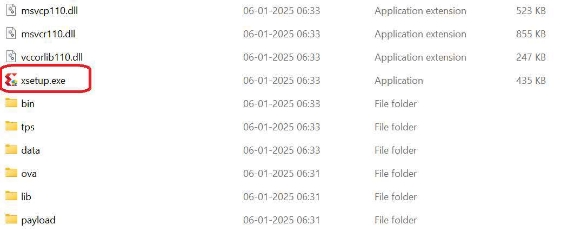

5. If it is asking to enable Java etc.. just Allow. 
5. Make sure the Virtualiza  on is enable 

   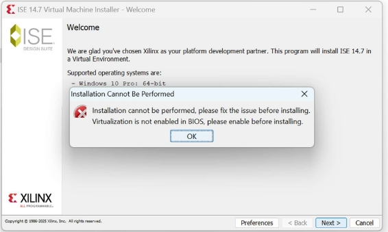

7. You can follow the steps men  oned below.  ![ref2]
1) Open search bar and type : Change advanced startup op  ons. Click that 

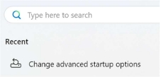

2) Click on Advanced Startup à Restart Now 

   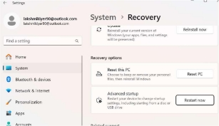

3) Your Laptop will restart. Bios will open  
3) Click on Troubleshoot 

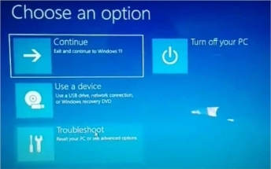

5) Click on UEFI Firmware se   ngs ![ref2]

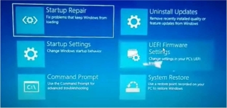

6) Click on Restart 
6) Under Configura  on Tab : Make sure Virtualiza  on is enabled. 

   A  er enabling , Again run the ISE xsetup.exe file 

8. S  ll if you get the Virtualiza  on error even a  er enabling it , do the below 

   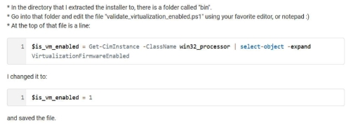

9. Run the xsetup.exe file 

   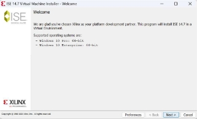

   Click on Next ![ref2]

10. Click on Con  nue 

    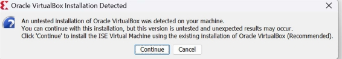

11. Click on I Agree, Next 

    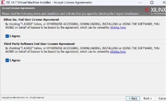

12. Click Next 

    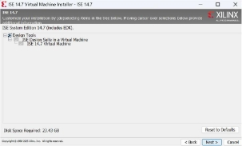

13. I am installing in my D-drive. (You can install in C drive if you wish.) 

It is important to create a directory as that will be shared with the virtual machine. So I went to D drive and created a directory first, named it ![ref2]as XILINX\_ISE\_PROJECTS . A  er crea  on of that directory, I cam back to this window and entered the path.  

Click on Next 

Don’t make any mistake in this step 

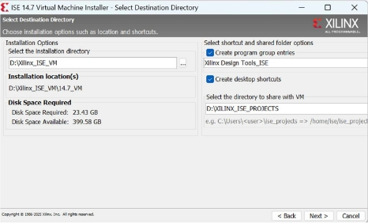

14. Now,  

    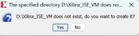

    Click Yes 

15. Then click Install 

    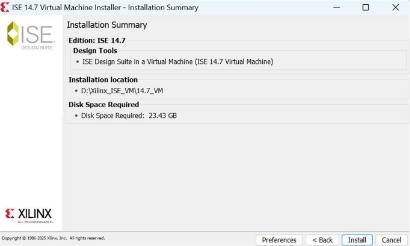

16. Installa  on completed. Click OK 

    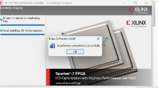

17. On the Desktop, you shpuld be able to see the shortcuts created.  ![ref2]Double click on the Project Navigator.  

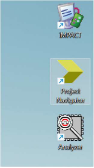

You will see that Virtual machine has opened. Close the right side popups 

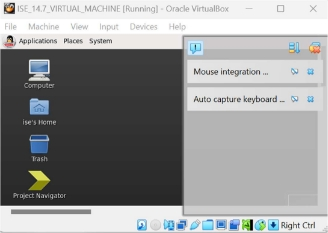

18. Maximize the window  

    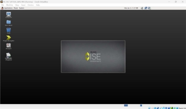

19. When you click on the ise’s Home folder, you will find that the SHARED folder “ XILINX\_ISE\_PROJECTS “ ![ref2]is also seen. All your projects must be created here inside this folder  

    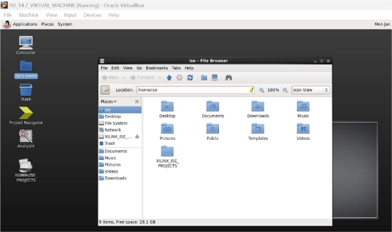

20. Double click on the Project navigator in the virtual machine 

    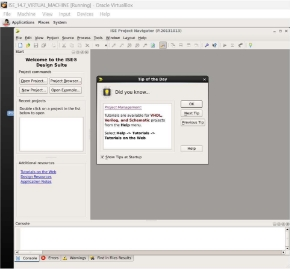

21. Now to to Fileà New Project.    Loca  onà Browse to the folder XILINX\_ISE\_PROJECTS Go to Next 

    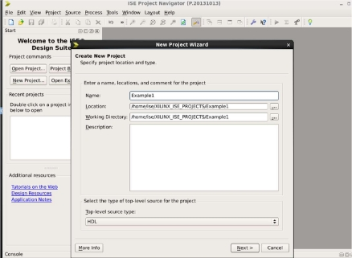

22. Enter Board details as shown and clock on Next and then Finish.  ![ref2]

    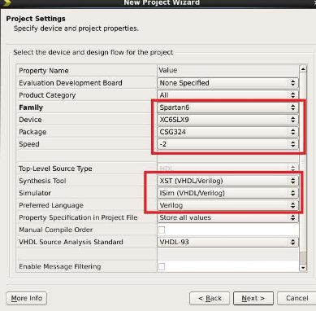

23. And start with your project !! 

NUMATO MIMAS V2 – SPARTAN 6 FPGA BOARD ![ref1]

h  ps://numato.com/product/mimas-spartan-6-fpga-development-board/ At the bo  om sec  on, you will see DOWNLOADS. Check the below 

1) USER MANUAL: Read this for b  er understanding of the board 
1) DOWNLAOD CONFIGURATION TOOL WINDOWS:  Download this & keep 
1) Download Numato Lab CDC driver.  Extract the .zip file & keep 
1) Click on User constraints file. New window will pop up. Copy the en  re thing in a .txt file and keep. 
Prepared by Lakshmi Iyer (Ph.D. Scholar, EE Dept., IIT Bombay) 

[ref1]: Aspose.Words.3ac67ff4-8a62-4ea8-be45-be1efc990598.001.png
[ref2]: Aspose.Words.3ac67ff4-8a62-4ea8-be45-be1efc990598.007.png
